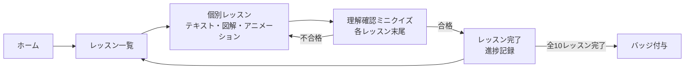
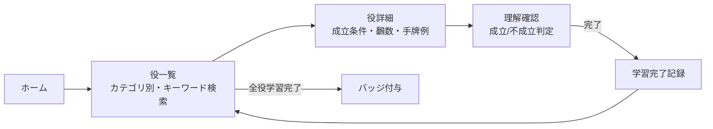
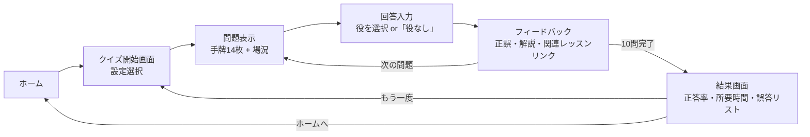
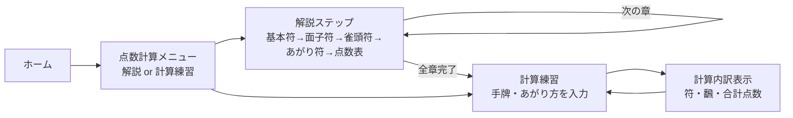
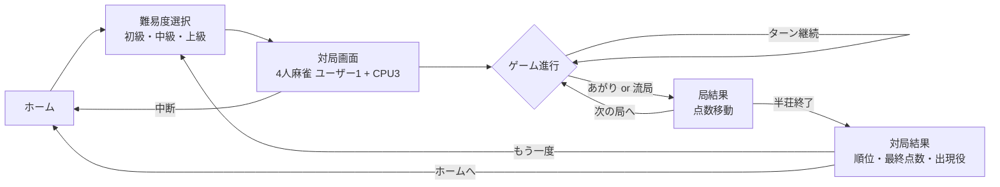
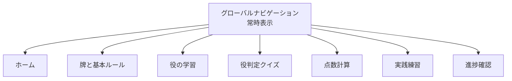

# 設計ドキュメント: 麻雀学習アプリ

## 概要

本アプリは、麻雀を学びたいユーザー向けのWebベース学習プラットフォームである。  
デスクトップブラウザ（Chrome・Firefox・Edge・Safari最新版）上で動作し、牌と基本ルールの学習から役の判定クイズ、点数計算、CPU対戦練習まで段階的な学習体験を提供する。

バックエンドサーバーは持たず、すべてのロジックをクライアントサイドで完結させる。学習進捗はブラウザのlocalStorageに永続化する。

---

## アーキテクチャ

### 全体方針

- **フレームワーク**: React（TypeScript）
- **状態管理**: Zustand（軽量でボイラープレートが少ない）
- **スタイリング**: Tailwind CSS（ダークモード対応が容易）
- **テスト**: Vitest + React Testing Library（ユニット）、fast-check（プロパティテスト）
- **ビルドツール**: Vite

サーバーレスの単一ページアプリケーション（SPA）として構成する。

### アーキテクチャ図

```mermaid
graph TD
    subgraph Browser
        UI[React UI Layer]
        Store[Zustand Store]
        subgraph Core Modules
            YakuEngine[役判定エンジン]
            ScoreCalc[点数計算モジュール]
            PracticeEngine[実践練習エンジン]
            ProgressTracker[進捗管理モジュール]
        end
        LocalStorage[(localStorage)]
    end

    UI --> Store
    Store --> YakuEngine
    Store --> ScoreCalc
    Store --> PracticeEngine
    Store --> ProgressTracker
    ProgressTracker --> LocalStorage
    PracticeEngine --> LocalStorage
```



### ページ・ルーティング構成

```
/                    ホーム（学習ダッシュボード）
/tiles               牌と基本ルールのレッスン
/tiles/:lessonId     個別レッスン
/yaku                役一覧
/yaku/:yakuId        役詳細
/quiz                役判定クイズ
/score               点数計算学習・計算機
/practice            CPU対戦練習
/progress            学習進捗
```

---

## ホーム画面設計

### レイアウト概要

ホーム画面は5つの学習モードへのエントリーポイントとなるカードグリッドを中心に構成する。

```
┌─────────────────────────────────────────────────────┐
│  NavBar（ロゴ + グローバルナビゲーション + ダークモード切替）       │
├─────────────────────────────────────────────────────┤
│  ようこそ、麻雀学習アプリへ                                    │
│  全体進捗: ██████░░░░ 62%                              │
├───────────────┬───────────────┬─────────────────────┤
│ 🀇 牌と基本ルール │ 🎴 役の学習     │ ❓ 役判定クイズ        │
│  進捗: 80%    │  進捗: 40%    │  正答率: 72%         │
│  [続きから]    │  [続きから]    │  [クイズ開始]          │
├───────────────┴───────────────┴─────────────────────┤
│      🔢 点数計算の学習           ⚔️ 実践練習            │
│        進捗: 20%                 対戦数: 3            │
│       [始める]                  [対局開始]             │
└─────────────────────────────────────────────────────┘
```

### カードコンポーネント仕様

各モードカードは以下の要素を持つ：

| 要素 | 内容 |
|---|---|
| アイコン | モードを直感的に示す絵文字またはSVGアイコン |
| タイトル | モード名（日本語） |
| 進捗インジケーター | プログレスバーまたはスコア表示 |
| CTAボタン | 未開始:「始める」/ 進行中:「続きから」 / 完了:「復習する」 |

```typescript
interface ModeCardProps {
  modeId: 'tiles' | 'yaku' | 'quiz' | 'score' | 'practice';
  title: string;
  icon: string;
  progress: ModeProgress;
  href: string;
}

interface ModeProgress {
  type: 'percentage' | 'accuracy' | 'count';
  value: number;        // 0〜100（percentage/accuracy）または整数（count）
  label: string;        // 例: "80%" / "正答率 72%" / "対戦数 3"
  status: 'not_started' | 'in_progress' | 'completed';
}
```

---

## 画面遷移フローと学習ステップ定義

### モード1: 牌と基本ルールの学習

**総ステップ数: 10レッスン**（数牌3種・字牌2種・基本用語6項目・ゲーム進行1）



| # | レッスン名 | 内容 |
|---|---|---|
| 1 | 萬子（マンズ） | 1〜9の数牌 |
| 2 | 筒子（ピンズ） | 1〜9の数牌 |
| 3 | 索子（ソーズ） | 1〜9の数牌 |
| 4 | 風牌 | 東南西北 |
| 5 | 三元牌 | 白發中 |
| 6 | ツモ・ロン | あがり方 |
| 7 | リーチ | リーチの掛け方 |
| 8 | ポン・チー | 鳴き |
| 9 | カン | カンの種類 |
| 10 | ゲームの進行順序 | 配牌〜あがりまでの流れ |

---

### モード2: 役の学習

**総ステップ数: 役の総数に依存（標準36役を想定）**



役一覧は以下のカテゴリで分類して表示する：

| カテゴリ | 代表役 |
|---|---|
| 基本役（1飜） | リーチ・タンヤオ・ピンフ・一盃口 |
| 複合役（2飜以上） | 三色同順・一気通貫・七対子 |
| 役満 | 天和・地和・大三元・字一色 |

---

### モード3: 役判定クイズ

**1セッション: 10問固定**



クイズ開始画面では以下を設定できる：

| 設定項目 | 選択肢 |
|---|---|
| 出題範囲 | 全役 / 学習済み役のみ |
| 問題数 | 10問 / 20問 |

---

### モード4: 点数計算の学習

**総ステップ数: 解説5章 + 計算練習（無制限）**



| # | 解説章 | 内容 |
|---|---|---|
| 1 | 基本符 | 30符の概念 |
| 2 | 面子符 | 各面子の符 |
| 3 | 雀頭符 | 雀頭の符 |
| 4 | あがり符 | ツモ・ロンの符 |
| 5 | 点数表の読み方 | 飜・符から点数を求める |

---

### モード5: 実践練習モード



対局画面の主要UI要素：

| 要素 | 説明 |
|---|---|
| 手牌エリア | プレイヤーの14枚を横並び表示 |
| 捨て牌エリア | 各プレイヤーの捨て牌（全員分） |
| ヒントパネル | 有効牌の強調・あがりまでの枚数 |
| CPUアクションログ | 直近のCPU操作履歴 |
| 中断ボタン | いつでもホームに戻れる |

---

## 並列学習設計

### 設計方針

すべての学習モードは完全に独立して動作し、いつでも中断・再開できる。ユーザーは複数モードを同時進行させることができる。



### localStorage によるモード別進捗管理

各モードの進捗は独立したキーで localStorage に保存し、相互に影響しない：

```typescript
// localStorage キー設計
const STORAGE_KEYS = {
  tiles:    'mahjong_progress_tiles',     // 完了レッスンIDリスト
  yaku:     'mahjong_progress_yaku',      // 学習済み役IDリスト
  quiz:     'mahjong_progress_quiz',      // クイズ履歴
  score:    'mahjong_progress_score',     // 完了章リスト
  practice: 'mahjong_progress_practice', // 対局履歴・中断状態
} as const;
```

各モードの中断・再開動作：

| モード | 中断時の保存内容 | 再開時の復元内容 |
|---|---|---|
| 牌と基本ルール | 現在表示中のレッスンID | 同じレッスンの先頭から再開 |
| 役の学習 | 最後に開いた役ID | 役詳細ページを直接表示 |
| 役判定クイズ | 進行中セッションの全問題と回答済み状態 | 中断した問題から再開 |
| 点数計算 | 最後に完了した章インデックス | 次の章または計算練習へ |
| 実践練習 | GameState全体（ターン数・手牌・山牌） | 対局画面を完全復元 |

### セッション状態管理インターフェース

```typescript
interface SessionState {
  mode: 'tiles' | 'yaku' | 'quiz' | 'score' | 'practice';
  lastVisitedAt: string;   // ISO 8601
  resumeData: unknown;     // 各モード固有の再開データ
}

interface ProgressStore {
  // 各モードの進捗を個別に取得・更新
  getTilesProgress(): TilesProgress;
  getYakuProgress(): YakuProgress;
  getQuizProgress(): QuizProgress;
  getScoreProgress(): ScoreProgress;
  getPracticeProgress(): PracticeProgress;

  // セッション状態の保存・復元
  saveSession(state: SessionState): void;
  loadSession(mode: SessionState['mode']): SessionState | null;

  // 全体完了率の計算（全モードを集計）
  calculateOverallCompletionRate(): number;
}
```

### ナビゲーション設計

NavBarはすべてのページで常時表示される。対局中（実践練習モード）でも確認なしにナビゲーションが可能だが、移動前に「対局を中断して移動しますか？」のダイアログを表示し、状態を保存してから遷移する。

---

## コンポーネントとインターフェース

### UIコンポーネント構成

```
src/
  components/
    common/
      TileImage        # 牌画像（alt属性付き）
      TilePopup        # 牌タップ時のポップアップ
      NavBar           # グローバルナビゲーション
      Badge            # 完了バッジ
    lessons/
      LessonCard       # レッスン一覧カード
      LessonViewer     # レッスン本文（テキスト・図解・アニメーション）
    yaku/
      YakuList         # 役一覧（検索機能付き）
      YakuDetail       # 役詳細（成立条件・例示）
    quiz/
      QuizBoard        # クイズ問題表示
      QuizResult       # クイズ結果画面
    score/
      ScoreForm        # 手牌・あがり方入力フォーム
      ScoreBreakdown   # 計算内訳表示
    practice/
      GameBoard        # 対局画面
      CPUActionLog     # CPU行動ログ
      HintPanel        # ヒント表示パネル
    progress/
      ProgressDashboard # 進捗ダッシュボード
  pages/
    HomePage
    TilesPage
    LessonPage
    YakuPage
    YakuDetailPage
    QuizPage
    ScorePage
    PracticePage
    ProgressPage
```

### コアモジュール インターフェース

#### 役判定エンジン（YakuEngine）

```typescript
interface YakuEngine {
  // 手牌を受け取り、成立している役のリストを返す
  detectYaku(hand: Hand, context: GameContext): Yaku[];
  // 手牌があがり形かどうかを判定する
  isWinningHand(hand: Hand): boolean;
}
```

#### 点数計算モジュール（ScoreCalculator）

```typescript
interface ScoreCalculator {
  // 手牌・あがり方・場況を受け取り、計算結果を返す
  calculate(hand: Hand, winCondition: WinCondition, gameContext: GameContext): ScoreResult;
}

interface ScoreResult {
  yaku: Yaku[];
  han: number;
  fu: number;
  basePoints: number;
  totalPoints: number;
  breakdown: ScoreBreakdownStep[];
}

interface ScoreBreakdownStep {
  label: string;  // 例: "平和符", "基本符"
  value: number;
}
```

#### 実践練習エンジン（PracticeEngine）

```typescript
interface PracticeEngine {
  startGame(difficulty: Difficulty): GameState;
  processPlayerDiscard(tile: Tile): GameState;
  processCPUTurn(state: GameState): Promise<GameState>; // 1秒以内
  getHint(hand: Hand): HintResult;
  saveGameState(state: GameState): void;
  loadGameState(): GameState | null;
}

type Difficulty = 'beginner' | 'intermediate' | 'advanced';
```

#### 進捗管理（ProgressTracker）

```typescript
interface ProgressTracker {
  markLessonComplete(lessonId: string): void;
  markYakuLearned(yakuId: string): void;
  recordQuizResult(sessionId: string, result: QuizSessionResult): void;
  recordPracticeResult(result: PracticeResult): void;
  getProgress(): UserProgress;
  resetProgress(): void;
  calculateCompletionRate(): number; // 0.0 〜 1.0
}
```

---

## データモデル

### Tile（牌）

```typescript
type TileSuit = 'man' | 'pin' | 'sou' | 'wind' | 'dragon';

interface Tile {
  id: string;         // 例: "man1", "wind_east", "dragon_haku"
  suit: TileSuit;
  value: number | null; // 数牌は1-9、字牌はnull
  name: string;       // 日本語名 例: "一萬"
  reading: string;    // 読み仮名 例: "いちまん"
  altText: string;    // アクセシビリティ用alt属性
}
```

### Hand（手牌）

```typescript
interface Hand {
  tiles: Tile[];         // 13枚（ツモ前）または14枚（ツモ後）
  drawnTile?: Tile;      // ツモ牌
  calledMelds?: Meld[];  // 鳴き面子
}

interface Meld {
  type: 'pon' | 'chi' | 'kan';
  tiles: Tile[];
}
```

### Yaku（役）

```typescript
interface Yaku {
  id: string;           // 例: "riichi", "tanyao"
  name: string;         // 日本語名 例: "リーチ"
  han: number;          // 飜数（鳴きなし）
  hanOpen: number | null; // 飜数（鳴きあり、食い下がりなしの場合null）
  description: string;
  conditions: string[]; // 成立条件テキストリスト
  examplesValid: Hand[];   // 成立例（最低2例）
  examplesInvalid: Hand[]; // 不成立例（最低2例）
}
```

### GameContext / WinCondition

```typescript
interface GameContext {
  roundWind: 'east' | 'south' | 'west' | 'north';
  seatWind: 'east' | 'south' | 'west' | 'north';
  isRiichi: boolean;
  isTsumo: boolean;
  doraIndicators: Tile[];
}

interface WinCondition {
  type: 'tsumo' | 'ron';
  winningTile: Tile;
}
```

### QuizSession

```typescript
interface QuizQuestion {
  id: string;
  hand: Hand;
  correctYaku: Yaku[];   // 複数役に対応
}

interface QuizSessionResult {
  sessionId: string;
  questions: QuizQuestion[];
  answers: QuizAnswer[];
  correctCount: number;
  totalCount: number;
  durationMs: number;
  completedAt: string;   // ISO 8601
}

interface QuizAnswer {
  questionId: string;
  selectedYaku: Yaku[];
  isCorrect: boolean;
}
```

### GameState（対戦状態）

```typescript
interface GameState {
  players: Player[];
  currentTurn: number;   // player index
  wall: Tile[];          // 山牌
  discardPiles: Tile[][]; // 各プレイヤーの捨て牌
  roundWind: string;
  turnNumber: number;
  phase: 'draw' | 'discard' | 'call' | 'end';
  difficulty: Difficulty;
}

interface Player {
  id: string;
  isHuman: boolean;
  hand: Hand;
  score: number;
}
```

### UserProgress

```typescript
interface UserProgress {
  completedLessons: string[];       // lessonId[]
  learnedYaku: string[];            // yakuId[]
  quizHistory: QuizSessionResult[];
  practiceHistory: PracticeResult[];
  badges: string[];
  lastUpdated: string;              // ISO 8601
}

interface PracticeResult {
  gameId: string;
  rank: number;             // 1〜4位
  finalScore: number;
  yakuEncountered: string[]; // yakuId[]
  completedAt: string;
}
```


---

## 正確性プロパティ（Correctness Properties）

*プロパティとは、システムのすべての有効な実行において成り立つべき性質・振る舞いのことである。人間が読める仕様と機械検証可能な正確性保証とを橋渡しする形式的な記述である。*

### プロパティ1: 牌ポップアップが必要情報を含む

*任意の* 牌（Tile）に対してタップ操作を行ったとき、ポップアップは牌の名称・読み方・分類（suit）をすべて含む。

**検証対象: 要件1.2**

---

### プロパティ2: 進捗記録ラウンドトリップ

*任意の* レッスンIDまたは役IDについて、`markLessonComplete(id)` または `markYakuLearned(id)` を呼んだ後に `getProgress()` を呼ぶと、そのIDが完了リストに含まれる。

**検証対象: 要件1.5, 2.4**

---

### プロパティ3: 役データが最低2例ずつ含む

*任意の* 役（Yaku）データに対して、成立する手牌パターン（examplesValid）が2つ以上、成立しない手牌パターン（examplesInvalid）が2つ以上存在する。

**検証対象: 要件2.3**

---

### プロパティ4: 役検索が合致する役のみ返す

*任意の* 検索クエリと役リストに対して、`searchYaku(query, yakuList)` の結果は元のリストのサブセットであり、かつすべての結果要素がクエリ文字列を名前または説明に含む。

**検証対象: 要件2.5**

---

### プロパティ5: クイズ回答フィードバックが解説を含む

*任意の* クイズ問題と回答に対して、フィードバックは正誤判定・正しい役名・成立理由をすべて含む。

**検証対象: 要件3.2**

---

### プロパティ6: 誤回答時に対応レッスンリンクが表示される

*任意の* 誤回答に対して、表示されるフィードバックUIは対応する役のレッスンページへのリンクを含む。

**検証対象: 要件3.4**

---

### プロパティ7: クイズ結果に必要情報が含まれる

*任意の* QuizSessionResult に対して、結果画面のレンダリングは正答率・所要時間・誤答した役の一覧をすべて含む。

**検証対象: 要件3.5**

---

### プロパティ8: 複数役手牌で部分一致を正解とする

*任意の* 複数の役を含む手牌において、そのいずれか1つ以上の役を回答として提出した場合、システムは正解として扱う。

**検証対象: 要件3.6**

---

### プロパティ9: ScoreCalculator が計算結果と内訳を返す

*任意の* あがり手牌・あがり方・場況の組み合わせに対して、`ScoreCalculator.calculate()` は han・fu・totalPoints・非空のbreakdownリストをすべて含む結果を返す。

**検証対象: 要件4.3, 4.4**

---

### プロパティ10: 不正手牌でエラーが返る

*任意の* あがりが成立しない牌の組み合わせに対して、`ScoreCalculator.calculate()` はエラー（あがり不成立）を返す。

**検証対象: 要件4.5**

---

### プロパティ11: CPUターンが1秒以内に完了する

*任意の* ゲーム状態・難易度に対して、`PracticeEngine.processCPUTurn(state)` が返す Promise は1000ミリ秒以内に解決する。

**検証対象: 要件5.3**

---

### プロパティ12: ゲーム結果に順位・点数・役が含まれる

*任意の* 対局終了状態に対して、`PracticeResult` は rank・finalScore・yakuEncountered をすべて含む。

**検証対象: 要件5.5**

---

### プロパティ13: GameState save/load ラウンドトリップ

*任意の* GameState に対して、`saveGameState(state)` を呼んだ後に `loadGameState()` を呼ぶと、元の状態と等価なオブジェクトが返る。

**検証対象: 要件5.6**

---

### プロパティ14: 進捗データ localStorage 永続化ラウンドトリップ

*任意の* UserProgress に対して、保存操作を行った後にロードすると元のデータと等価なオブジェクトが返る。

**検証対象: 要件6.1**

---

### プロパティ15: ダッシュボードが必要情報を含む

*任意の* UserProgress に対して、進捗ダッシュボードのレンダリングは学習済みレッスン数・クイズ正答率・対戦成績をすべて含む。

**検証対象: 要件6.2**

---

### プロパティ16: 完了率が 0〜100% の範囲に収まる

*任意の* UserProgress に対して、`calculateCompletionRate()` の戻り値は 0.0 以上 1.0 以下である。

**検証対象: 要件6.3**

---

### プロパティ17: リセット後に進捗が空になる

*任意の* UserProgress（空でないもの）に対して、`resetProgress()` を呼んだ後の `getProgress()` は completedLessons・learnedYaku・quizHistory・practiceHistory がすべて空のリストである。

**検証対象: 要件6.5**

---

### プロパティ18: TileImage が alt 属性を持つ

*任意の* Tile データに対して、`TileImage` コンポーネントのレンダリングは空でない alt 属性を持つ img 要素を含む。

**検証対象: 要件7.3**

---

## エラーハンドリング

### 入力バリデーション

| シナリオ | 対処 |
|---|---|
| あがりが成立しない手牌をScore_Calculatorに渡す | 「あがりが成立しません」メッセージを表示。計算処理は行わない（要件4.5） |
| 空のクイズ回答を提出 | 送信ボタンを非活性化し、回答を選択するよう案内 |
| localStorage が使用不可（プライベートブラウジングなど） | エラーをログに記録し、進捗保存ができない旨をユーザーに通知。機能自体は継続動作 |

### ネットワーク切断（対戦モード）

対戦モードはすべてクライアントサイドで動作するため、ネットワーク切断の影響を受けない。ただし、ゲーム状態は毎ターン後に localStorage に保存し（要件5.6）、ページリロード後に復元できるようにする。

### 不正な状態遷移

- PracticeEngine は内部状態機械として実装し、無効なフェーズ遷移（例: draw フェーズ中に discard を要求）は例外をスローせず、ログ出力の後に現在の状態を維持する。
- クイズセッション中に10問未満で終了しようとした場合、セッションを継続させる。

---

## テスト戦略

### 二層テストアプローチ

**ユニットテスト**（Vitest + React Testing Library）と **プロパティベーステスト**（fast-check）を組み合わせる。

- ユニットテスト: 具体的な例・エッジケース・統合ポイントの確認
- プロパティテスト: 普遍的な性質をランダムな大量入力で検証

### ユニットテスト対象

- 各レッスンページの必須コンテンツが存在する（要件1.1, 1.3, 1.4, 2.1, 4.1, 4.2, 5.1, 5.2, 5.4）
- 全レッスン完了時にバッジが表示される（要件6.4）
- ダークモード切り替えでクラスが適用される（要件7.4）
- WCAG コントラスト比の確認（axe-core 使用、要件7.2）
- 日本語 UI テキストの存在確認（要件7.5）
- クイズセッション開始時に10問以上含まれる（要件3.3）

### プロパティベーステスト対象

各 Correctness Property（P1〜P18）それぞれに1つのプロパティテストを実装する。

**設定**:
- ライブラリ: [fast-check](https://fast-check.dev/)（TypeScript ネイティブ、Vitest との統合が容易）
- 最小反復回数: 各テスト100回以上

**タグ形式**:
```
// Feature: mahjong-learning-app, Property N: <property_text>
```

**実装例（P2: 進捗記録ラウンドトリップ）**:
```typescript
// Feature: mahjong-learning-app, Property 2: 進捗記録ラウンドトリップ
it('markLessonComplete then getProgress contains lessonId', () => {
  fc.assert(
    fc.property(fc.string({ minLength: 1 }), (lessonId) => {
      const tracker = createProgressTracker();
      tracker.markLessonComplete(lessonId);
      expect(tracker.getProgress().completedLessons).toContain(lessonId);
    }),
    { numRuns: 100 }
  );
});
```

**実装例（P16: 完了率の範囲）**:
```typescript
// Feature: mahjong-learning-app, Property 16: 完了率が 0〜100% の範囲に収まる
it('calculateCompletionRate always returns 0.0 to 1.0', () => {
  fc.assert(
    fc.property(arbitraryUserProgress, (progress) => {
      const rate = calculateCompletionRate(progress);
      expect(rate).toBeGreaterThanOrEqual(0.0);
      expect(rate).toBeLessThanOrEqual(1.0);
    }),
    { numRuns: 100 }
  );
});
```

### テストファイル構成

```
src/
  __tests__/
    units/
      LessonPage.test.tsx
      YakuList.test.tsx
      QuizBoard.test.tsx
      ScorePage.test.tsx
      PracticePage.test.tsx
      ProgressDashboard.test.tsx
    properties/
      tilePopup.property.test.ts          # P1
      progressTracker.property.test.ts    # P2, P14, P15, P16, P17
      yakuData.property.test.ts           # P3, P4
      quiz.property.test.ts               # P5, P6, P7, P8
      scoreCalculator.property.test.ts    # P9, P10
      practiceEngine.property.test.ts     # P11, P12, P13
      tileImage.property.test.ts          # P18
```
